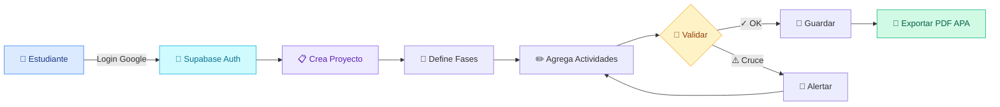

<!--  ╔══════════════════════════════════════════════════════════════════════╗
     ║                       README · ALBEIRO RAMOS                        ║
     ║          Presentación + showcase del proyecto Cronograma             ║
     ╚══════════════════════════════════════════════════════════════════════╝  -->

<div align="center">

<!-- ▼▼▼  HERO con muñeco saludando + tipografía animada  ▼▼▼ -->

<picture>
  <source media="(prefers-color-scheme: dark)" srcset="https://capsule-render.vercel.app/api?type=waving&color=0:3b82f6,50:06b6d4,100:8b5cf6&height=220&section=header&text=Hola,%20soy%20Albeiro&fontSize=54&fontColor=ffffff&animation=fadeIn&fontAlignY=38&desc=Estudiante%20·%20Desarrollador%20·%20Investigador&descAlignY=62&descSize=18" />
  
</picture>

<!-- Muñeco saludando -->

&nbsp;


</div>

<br>

<!-- ▼▼▼  TARJETA "QUIÉN SOY"  ▼▼▼ -->
<div align="center">

```
        ╭───────────────────────────────╮
        │                               │
        │      ░░░░░░░░░░░░░░░░░        │
        │    ░░  ╭──────────╮  ░░       │
        │   ░░   │  ◕    ◕  │   ░░      │      Albeiro Ramos Saldaña
        │   ░░   │     ▽    │   ░░      │      ━━━━━━━━━━━━━━━━━━━━
        │   ░░   │   ╰─╯    │   ░░      │     "Aprender · Crear · Compartir"
        │    ░░  ╰──────────╯  ░░       │
        │      ░░░░░░░░░░░░░░░░░        │
        │           ┃ ┃ ┃               │
        │      ╭────┻─┻─┻────╮          │
        │      │  </>  ☕  📚 │          │
        │      ╰──────────────╯         │
        │                               │
        ╰───────────────────────────────╯
```

</div>

<!-- ▼▼▼  SOBRE MÍ  ▼▼▼ -->

## 🧑‍💻 Sobre mí

> 💡 **Soy estudiante** apasionado por la **investigación**, la **educación** y el **desarrollo de software** con propósito.
> Construyo herramientas digitales que ayudan a otros estudiantes a organizarse, aprender y completar sus proyectos académicos.

```diff
+ 🎓  Apoyo del Seminario de Investigación II
+ 🌱  Aprendiendo cada día algo nuevo
+ 🛠️  Construyendo cronogramas, dashboards y apps educativas
+ 🇨🇴  Desde Colombia para el mundo
! 📬  ¿Charlamos? → palabracomplementada@gmail.com
```

<!-- ▼▼▼  STACK TECNOLÓGICO con iconos animados  ▼▼▼ -->

## 🧰 Mi stack

<div align="center">

<a href="https://skillicons.dev">
  
</a>

<br><br>

<!-- Badges secundarios -->


</div>

<!-- ▼▼▼  PROYECTO DESTACADO ▼▼▼ -->

## 🌟 Proyecto destacado · Cronograma de Anteproyecto

<div align="center">



</div>

### ✨ Lo que hace

| | |
|---|---|
| 🔐 | **Login con Google** (Supabase OAuth) o modo invitado local |
| 📊 | **Diagrama de Gantt** profesional con fases, actividades y sub-actividades |
| 🎨 | **Plantillas listas**: intervención 16 sem · cualitativa 16 sem · tesis completa 32 sem |
| ⚡ | **Estados y prioridades** con sonido de feedback |
| 🚨 | **Alertas inteligentes** de cruces y dependencias rotas |
| ⏱️ | **Toast "Deshacer 10s"** tras cada eliminación |
| 📄 | **Exportación PDF formato APA** con cabecera de meses, semanas y días |
| 🌐 | **Sincronización en la nube** entre dispositivos |

### 🚀 Demo en vivo

<div align="center">

[](https://seminarioii.vercel.app/)
[](https://github.com/KRYPTON427/SEMINARIOII)
[](./SETUP.md)

</div>

<!-- ▼▼▼  GITHUB STATS ▼▼▼ -->

## 📊 Mi GitHub en números

<div align="center">

<a href="https://github.com/KRYPTON427">
  
</a>
<a href="https://github.com/KRYPTON427">
  
</a>

<br>

<a href="https://git.io/streak-stats">
  
</a>

</div>

<!-- ▼▼▼  LO QUE ESTOY HACIENDO AHORA ▼▼▼ -->

## 🎯 En qué ando

```yaml
🌱 aprendiendo:    [Supabase, OAuth, PostgreSQL RLS, jsPDF]
🔭 trabajando_en:  Cronograma de Anteproyecto v1
📝 investigación:  Apoyo metodológico para Seminario de Investigación II
🎨 explorando:     Diseño de UX accesible (WCAG, prefers-reduced-motion)
☕ combustible:    Café colombiano + curiosidad
```

<!-- ▼▼▼  CONTACTO ▼▼▼ -->

## 📬 Hablemos

<div align="center">

<a href="mailto:palabracomplementada@gmail.com">
  
</a>
<a href="https://github.com/KRYPTON427">
  
</a>
<a href="https://seminarioii.vercel.app/">
  
</a>

</div>

<!-- ▼▼▼  CITA INSPIRADORA ▼▼▼ -->

<div align="center">

> _"La mejor manera de predecir el futuro es construyéndolo."_
> — Alan Kay

<br>


<sub>Hecho con 💙 por Albeiro Ramos · Apoyo Seminario de Investigación II · 2026</sub>

</div>
